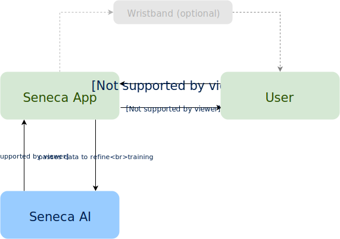

# Mobile App

The mobile Seneca App is used to collect data which in turn are fed to the Seneca AI. 
Optionally other devices can be connected to the app. Currently I am working on a vibrating 
wristband which replaces the audiovisual communication with the user by substituting speech
and GUI by haptic feedback.

This project does not contain the Seneca AI. You can find the project for 
this [here](https://github.com/DeepSeneca/SenecaAI/README.md).

# The problem and the idea

Usually I have a fully packed schedule each day. This is the result of being interested in too
many things (yes life is great and interesting :) ). One of the effects I realized and which
are also taught in learning theory is that different type of tasks during the day are differently
productive and/or easy to do depending on the time of day.

If I play the piano in the evening for instance, the rehearsal and improvement of my play are much
greater in contrast to when I would play during the day. Likewise doing pyhsical exercises during
my morning seems much more productive and fun. These are just 2 tasks which could be easily
planned and managed (just do sports in the morning and music in the evening). But as soon as the
number of tasks rises it gets more and more complicated. My personal schedule each day at the moment
consists of 48 different tasks. And these tasks contain variable tasks which may be totally different 
in nature each day. And this even doesn't account for daily surprises and the schedule of other people
which may make adjustments necessary.

To get more insight in the distribution of my day I started recording each task of my day 3 years 
ago using a simple Android app which is the foundation of the app you can find in this repository 
soon. I had done recording long before on paper and with the condensed wisdom of a lot of books 
about organizational theory, motivational theory, habit forming, learning theory and various other 
fields. The app helped me to gain more insight about my daily routine and I could gather data of about 
3 years to work with.

So the idea behind all of this is to find a optimal distribution of tasks each day, including tasks
of variable nature. This also means that given different input parameters e.g. 3 tasks already finished,
time of day, type of previously finished task, weather .. etc, the next "good" task to do can be 
recommended by the app and therefore act as your personal advisor which is highly customized to
your personal day.

At the moment the measurement of feedback comes from the user which rates the just finished task with a
number between 1 and 10. One key idea is that this rating is not a fixed mapping to measure
producitivty for each given task. The number should represent a personal view about the task just
finished. This could be things like ease of completion, productivity or fun doing the task. Or it
could be a combination of these factors. The interpretation should come intuitively from the user
in order to allow a personalized bias and goal instead of a fixed optimization regarding time for 
example.

An important key point is that the handling of the app should be as less intrusive as possible. This
means in the ideal case that the the user doesn't have to interact at all. The minimal solution 
at the time is that the user starts and stops the task, gives a score to the just finished task and 
in case of a longer period of abscense between the activity which the user has done before starting 
a new task. A lot of other information is collected without the need of user input by the capabilities
of modern smartphones. Feedback to the user is given by voice output over the smartphone. I am 
currently working with a vibrating wristband to replace the voice feedback by haptic feedback over 
vibration motors in the band. See below for more information about the wristband.

The collected data is fed into a neural network in order to train a model which finds 'optimal' 
sequences that represent an indivual day based on the users previous interactions. Each additional task
which has been finished during this daily sequence influences the generation of a new recommendation.
This depends on if the user followed the sequence or not. The training process does not happen in the 
app itself but on a local machine due to the high computational costs. The trained model is then used 
by the app to predict the next 'optimal' task given input parameters by the app (e.g. time of day, 
day of week, type of task .. etc). The app advises proactively new tasks as a good advisor should and 
not as a reaction to some user interaction.

# Privacy considerations

I am very well aware that if you input the data for your whole day you entrust important and valuable
data to the app. In order to be able to process the data it is however not necessary to know the content
or meaning. Therefore the naming of a task is only show the user the relevant information. The actual
name and meaning does not matter for the training of the Seneca AI. Task namings will be converted to
numbers which are specific to the app of the user.

There may be the strong possbility to create a fingerprint of the data of one user. The way the data is
stored and labeled should at least proccess the data pseudonymously. Further privacy considerations will
be incorporated.

# Features of the app

## Main screen

Soon.

## Task and routine management

The user customizes a daily routine which consists of tasks. The routine will be customizied usually only
once. Each day you start this routine will be presented to you. 

Each task can have 3 different aditional properties or combinations of these properties.

### Static tasks

These are the things you do every day. They have no special semantic and can be started, stopped and
rated.
	
### Variable tasks

These are tasks which represent a time-slot of your day which may be different every day and should be
parameterized accordingly when you plan ahead. 
	
### Timed tasks

Timed task will notify you if the time you set for this task is over. This is heavily inspired by the
Pomodoro technique which cut's work in evenly distributed work units that are timed. The idea behind
the Pomodoro technique is to maintain focus an energy longer if you do bursts of work followed
by small breaks.

### Consecutive tasks

Sometimes you don't want to be disturbed for a period of time. You can chain serveral tasks together
that will be started and stopped automatically for you.

## Advisor

This is the core functionality of the app.

## Goal achievement and rewards

It is helpful to define goals you want to achieve with your work. The app let's you define goals which
can be expressed by the tasks. An example for this would be to do physical exercise each day for at 
least 1 hour. This goal could be composed of 2 consecutive timed tasks each 30 minutes long. You will 
be notified and rewarded if you did achieve to complete the according tasks.

# Feedback

I am very happy to recieve any form of feedback on the idea or implementation.

# Current results

Coming soon.

# Implementation

- Android
- Kotlin
- Tensorflow
- Python
- Bluetooth

# How to use

Coming soon.

# Installation

Coming soon.

# The wrist band

As mentioned before it is important for daily usage to limit the user interaction to a minimum. It
would be great if there would be no interaction at all. I am fascinated by human augmentation such as
in the videogame series Deus Ex or in real-life as the Neuralink project. I think that the goal of
technolgical advancements in AI should be to assist and maybe even enhance humans on a very personal, 
customized level.

Inspired by a TED-Talk about the creation of new senses I decided to experiment with a more direct way
of feedback to the user. In order to achieve that I am using a LILYGO T-WATCH-2020. This is a freely
programmable Smart Watch which most important contains vibration motors. These vibrators are used to
give haptic feedback. Instead of talked to by the smartphone the user can 'sense' what Seneca will
suggest next. Information is encoded in vibrational patterns.

This leads to an almost invisible assistant which is tightly coupled to your body without any need
for surgery.

Communication happens via Bluetooth between smartphone and smartwatch.

# Why Seneca?

Here comes an insightful story soon.

# Interesting reads

